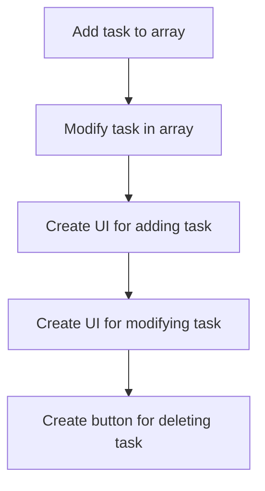

# todo-ai
Create a TODO app that has tasks and task can be active or done

# workflow 

```mermaid
graph TD;
    A[Add task to array] --> B[Modify task in array];
    B --> C[Create UI for adding task];
    C --> D[Create UI for modifying task];
    D --> E[Create button for deleting task];
```

